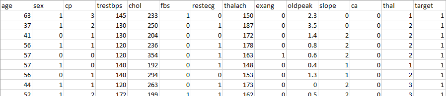

# KMeansSciKit
This KMeans Python example has been designed to explore how KMeans clustering can analyse different CSV datasets.
The Mall Customers dataset contains 3 columns of data to produce a 3d interactive graph, however the Heart Disease dataset contains 14 columns so has too many dimensions to produce a graph and will only output a save file with the cluster numbers attached to the original data.

This program uses the elbow method to determine the optimum number of clusters.

Once dependencies are all installed the program will run with onscreen prompts to determine which dataset is used and how many clusters to use.

Dependencies
For this program to run correctly, it must be executed on a system with a GUI for the graphs to be displayed correctly. The following software and libraries must also be installed before running the program.

Python (software) – Install before libraries.

The program has been created using Python 3.9. Compatibility with other versions is unknown.
Windows:

Python can be acquired from https://www.python.org/downloads/

Download the required installer, run, and follow onscreen instructions.

Linux:

Using Terminal run the following command to install the latest version of python

$sudo apt install python

SciKit-Learn (library)

The SciKit-Learn library provides tools for data analysis and performing functions such as K-Means and Scalar operations within python.
With Python installed use the following command to install SciKit-Learn through Pip3
Windows

Using CMD run the following command:

:>pip install scikit-learn

Linux

Using Terminal run the following command:

$pip install scikit-learn

Pandas (library)

The Pandas library is used for reading and storing and analysing the information contained in the CSV dataset. 
With Python installed use the following command to install Pandas through Pip3

Windows

Using CMD run the following command:

:>pip install pandas

Linux

Using Terminal run the following command:

$pip install pandas

MatPlotLib (library)

The MatPlotLib library is used to plot graphs and display the results of the K-Means algorithm and Elbow Method SSE report. (MatPlotLib, 2012)
With Python installed use the following command to install MatPlotLib through Pip3

Windows

Using CMD run the following command:

:>pip install matplotlib

Linux

Using Terminal run the following command:

$pip install matplotlib

NumPy (library)

The NumPy library is used to create arrays and multi-dimensional matrices for the K-means algorithm.
NumPy is pre-installed with python so no further action is required.

Dataset 1
The first dataset being used for this program is “Mall Customers” which is an example set that simulates spending information, accessed from:

https://www.kaggle.com/shwetabh123/mall-customers

The dataset is a Comma Spaced Value (CSV) file that contains mock spending data for 200 customers in a mall, containing the CustomerID, Gender, Age, Annual Income in $x1000(k$) and their Spending Score, indicating how much they spend in the mall. 

Dataset 2
The second dataset is called “Heart Disease UCI” that uses medical records to track heart disease risks. Accessed from:

https://www.kaggle.com/ronitf/heart-disease-uci 

The dataset is a CSV file containing a cut downm 14 attribute version of the original dataset produced by Andras Janosi, M.D. William Steinbrunn, M.D. Matthias Pfisterer, M.D. Robert Detrano, M.D., Ph.D. that contained 75 attributes. Some attributes that are represented by their numeric value such as age and the maximum heart rate (thalach) and some attributes are a numeric representation of a category, such as chest pain type.
